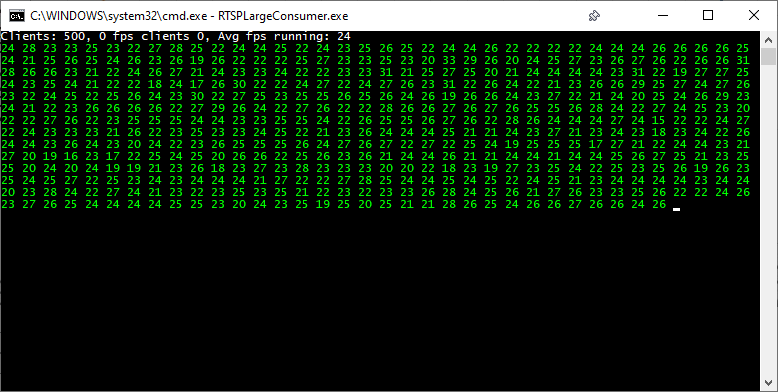

# RTSP Large Consumer

## Purpose
This project was developed for consuming large amounts of RTSP streams, specifically for load testing of RTSP sources.
It runs by the Windows console and reads `RTSPLargeConsumer.txt`  for instructions on what resources to consume, and then consumes the data and displays an estimation of the recieved FPS by each stream.



### Settings file

A plain text format has been selected for the settings file with the motivation of that a bulk list of RTSP URL's is cumbersome to insert in for example a JSON object manually.

`//` Lines beginning with double slash are excluded, as well as empty lines

`|` pipe is used after a URL as a separator, followed by an integer, to consume the URL n amount of times

The settings file is recreated as below if non existent.

```// File that descibes what to consume
// File that descibes what to consume

// Consume one of the following URL
rtsp://wowzaec2demo.streamlock.net/vod/mp4:BigBuckBunny_115k.mp4

// Consume 5 of the following URL
rtsp://wowzaec2demo.streamlock.net/vod/mp4:BigBuckBunny_115k.mp4|5

// This gets a total of 6 streams to consume
```

### How to run

Well, download and compile maybe?

Or if you're lazy, get the binaries from `/binaries`.

The project requires .Net 6.

#### Author

Author: [Christoffer Järnåker](https://github.com/jrnker)

#### Copyright

Following the masterprojects MIT licence 

#### Credits

Credits to [Nicolas Graziano](https://github.com/ngraziano) for the project this makes use of, https://github.com/ngraziano/SharpRTSP.


